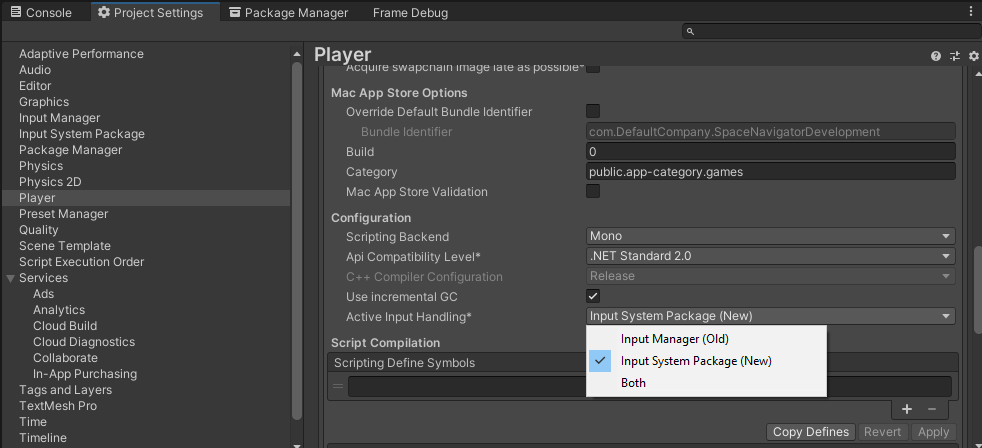

# SpaceNavigator
A Unity3D driver for the SpaceNavigator and other 3DConnexion devices.

This driver lets you fly around your scene and allows you to move items around.  
It can also be used at runtime via scripting.  

The default mode is **Fly** mode and when you're flying around, this driver keeps your horizon horizontal.  
So you don't have to worry about ending up upside down, just go where you want and get some work done.  
To comfortably navigate large areas and minute details, you can easilly switch between 3 customizable sensitivity presets.  
To move stuff around, you can use 2 modes: Telekinesis and GrabMove.  
In **Telekinesis** mode, you can move the stuff you selected with the SpaceNavigator, while your camera stays put.  
(this mode can be operated in Camera-, World-, Parent- and Local coordinates)  
In **GrabMove** mode the stuff will be linked to your camera so you can take it with you and position it where you want.  
Translation can be snapped to a grid and rotation can be angle-snapped.  

If you encounter issues, please report them via the project's [Github Issues](https://github.com/PatHightree/SpaceNavigator/issues) page.  
If you have feedback, please use this [thread](http://forum.unity3d.com/threads/182382-SpaceNavigator-driver-OpenSource) on the Unity forums.  
The source code is available on [Github](https://github.com/PatHightree/SpaceNavigator).

## What's new in 2.0.0 ?
### New foundation, new requirements
The driver's foundation has been rebuilt and it is now compatible with Unity 2019.1 and up.   
It communicates directly with the HID device via Unity's new Input System.  
This means that it **no longer requires the 3DConnexion driver** to be running or even installed.  
It also means that **your project is required to have the new Input System enabled**.  
You can have both the old and new Input System active, see this [tip](#tip_project_settings).  
(this [page](https://docs.unity3d.com/Packages/com.unity.inputsystem@1.0/manual/Migration.html) can help with upgrading to the new Input System)

### SpaceNavigator driver as a package
The driver is structured as a UPM package and can be added to your project via the Project Manager.  
See the [download](#download) section for details.

## Download
- The driver can now be downloaded via the Package Manager window
  - From git url :
    - Click the + button in the top left of the Package Manager window
    - Choose *Add package from GIT url...*
    - Enter https://github.com/PatHightree/SpaceNavigator.git  
      Note, for this you need to have git installed on your system !
  - From disk :
    - Download the driver from the github [releases page](https://github.com/PatHightree/SpaceNavigator/releases)
    - Click the + button in the top left of the Package Manager window
    - Choose *Add package from disk...*
- ~~The full [package](http://u3d.as/51X) is available on the Unity asset store.~~  
  *Todo: Update asset store package to v2.0.0*  
  
If you want to install a specific version, download it from the github [releases page](https://github.com/PatHightree/SpaceNavigator/releases) and install it via the *From Disk* method.

## Installation
- Add the driver to your project as described in the [Download](#download) section
- If your project was not yet using the new Input System, you have 2 options :
  - Use both input systems simultaneously 
    - Close and reopen the project
    - A popup will ask you to switch to the new Input System, choose **NO**
    - Set *Project Settings/Player/Active Input Handling* to **Both**  
    See this [tip](#tip_project_settings)
  - Switch to the New Input System
    - Close and reopen the project
    - A popup will ask you to switch to the new Input System, choose **Yes**
    - The project will close and reopen itself
    - You will have to modify any code which used the old Input System  
      [Here](https://docs.unity3d.com/Packages/com.unity.inputsystem@1.0/manual/Migration.html) is an overview of common old Input usages and their new equivalents 
- Fly away

## Upgrading from 1.x
When upgrading from a pre-2.0.0 version of the plugin, please follow these steps :
- Close the SpaceNavigator editor window
- Delete the SpaceNavigator folder from your project
- Delete Plugins\3DConnexionWrapperU4.bundle from your project
- Add the driver to your project as described in the [Download](#download) section
- Install the driver by following the steps in the [Installation](#installation) section

If you delete the folder while the SpaceNavigator window is still open, Unity will throw some errors.
When this happens, choose the default layout from the layout dropdown in the top right of Unity's UI and everything should return to normal.

## Upgrading from 2.x
At this time the Package Manager window does not show all available versions in a git repo.  
So until this changes, the upgrade process consists of removing the old version and installing a new one as described in the [Download](#download) section.

## Samples
To install these samples, open the SpaceNavigator package in the Package Manager window and click the Import button in the Samples section.
### Runtime Samples
The package also contains a couple of samples of runtime applications :
- Fly around.unity: Fly around with a sphere while knocking over some cubes.
- Folow curve.unity: Make your torus follow the curve, but don't touch it!  
### Input Helper
The Input Helper is a utility to collect all info on your 3DConnexion device.  
If your 3Dconnexion device has a data layout which is not yet supported by the driver,
please file an issue on the [GitHub Issues](https://github.com/PatHightree/SpaceNavigator/issues) page and supply the data this tool collects.  
After installation you can find the tool in the pull-down menu under _Window/SpaceNavigator/Save all HID descriptors to files_.

## Known bugs and limitations
- The New Input System package must be active for this driver to work
- Grab Mode only works in the camera coordinate system

## Credits
- Felix Herbst for the input helper and adding scene focus to runtime navigation
- William Iturzaeta from Canon Medical Systems USA, for hiring me to make this project compatible with Unity 2020  
  The proceeds of this job have been donated to cancer research
- Stephen Wolter for further refinement to the mac drift fix 
- Enrico Tuttobene for contributing the mac drift fix
- Kieron Lanning for implementing navigation at runtime
- Chase Cobb from Google for motivating me to implement the mac version
- Manuela Maier and Dave Buchhoffer (@vsaitoo) for testing and development feedback
- Ewoud Wijma for loaning me the Hackingtosh for building the Mac port
- Quaternion math by Minahito
  http://sunday-lab.blogspot.nl/2008/04/get-pitch-yaw-roll-from-quaternion.html

## Tip : You can switch input systems in Project Settings

## Tip : Disable 3DConnexion KMJ Emulator
If you're using the 3dconnexion driver, it comes with a keyboard, mouse, joystick emulator.  
Personally I have never needed it and it interferes with some games and applications.  
Here's how to disable it on Windows 10:
- Open the device manager by pressing Windows-X and choosing Device Manager
- Navigate to Human Interface Devices/HID-compliant game controller
- Select it and click the down arrow button
- If there are more entries called HID-compliant game controller,  
  disable the one which properties say Location: on #Dconnexion KMJ Emulator

